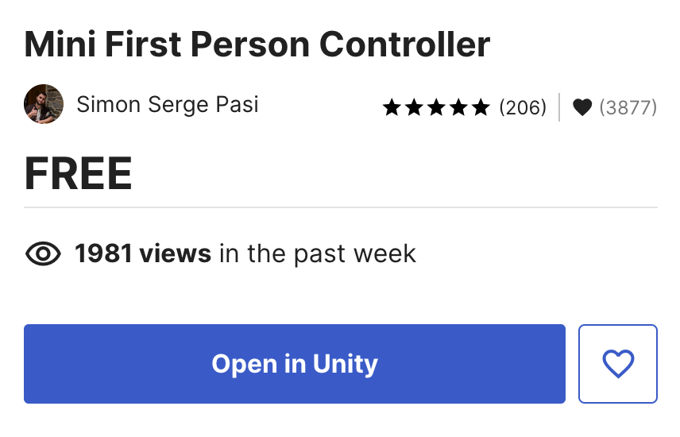
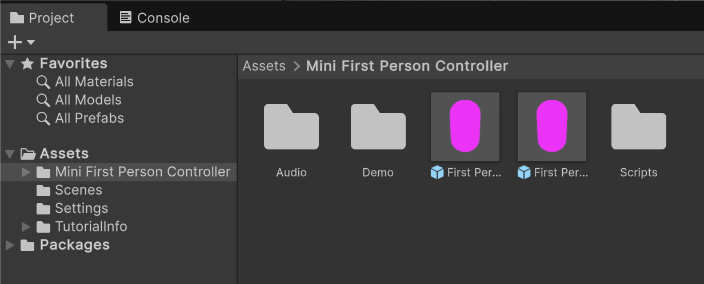
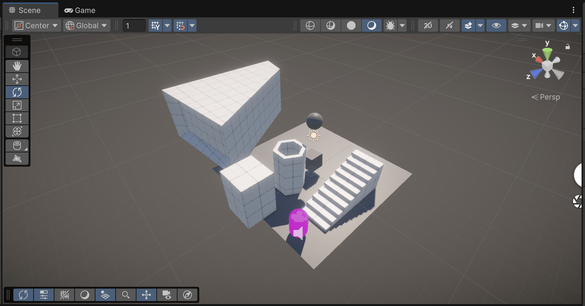
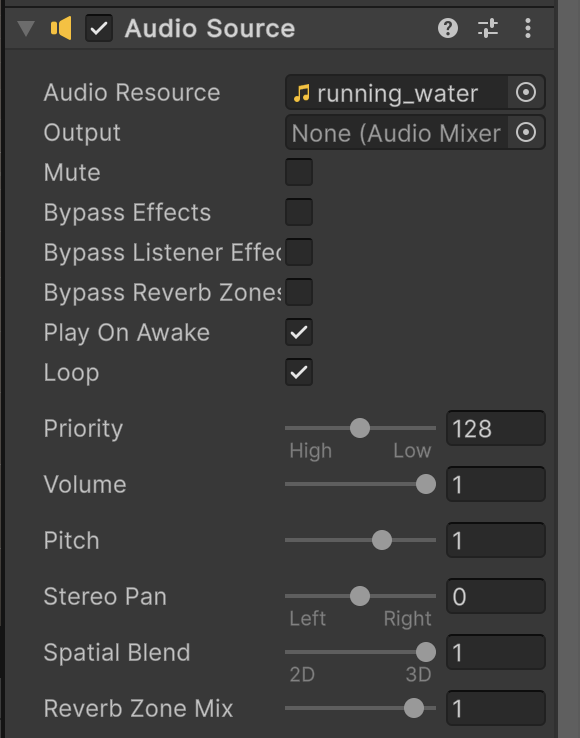

# Morning Session: Building Your Virtual Space

**Wednesday, April 22 | 10:00 – 13:00**

Welcome to your first steps in Unity. This morning, we're moving from a blank slate to a walkable 3D gallery. We'll focus on the interface, basic physics, and building custom architecture.

---

## 1. Foundation: Project Setup

When you first open the Unity Hub, click **New Project** and select the **Universal 3D** template. This uses the **Universal Render Pipeline (URP)**, which is the industry standard for performance and high-quality visual effects.

---

## 2. Navigating the 3D World

Unity’s interface can look complex, but you only need five main windows to build your world: **Hierarchy**, **Project**, **Scene**, **Game**, and **Inspector**.

### Mastering Movement
Right-click in the **Scene view** and use **WASD** to fly around like a video game. To manipulate objects, keep these shortcuts in mind:
*   **W** – Move
*   **E** – Rotate
*   **R** – Scale
*   **Y is Up** – Always remember the vertical axis is Y.

> **Deep Dive:** [Explore the Unity Editor](https://learn.unity.com/tutorial/explore-the-unity-editor-1?version=2021.3)

---

## 3. Creating Your First Objects

Let's populate the void. Right-click in the **Hierarchy** and select **3D Object > Plane** to create a floor.

### Precision Placement
Next, add a **Cube**. Look at the **Inspector** tab on the right to see its **X, Y, and Z** coordinates. To ensure it's perfectly centered, click the three vertical dots next to the **Transform** component and select **Reset**. This snaps it to (0, 0, 0).

### Setting the View
Press the **Play** button at the top. You might notice the camera is looking at nothing. To fix this:
1.  Stop Play mode.
2.  In the **Scene view**, fly to a position where you like the view of your objects.
3.  Select the **Main Camera** in the Hierarchy.
4.  Press **Shift + Cmd + F** (Mac) or **Shift + Ctrl + F** (Windows) to **Align with View**.

---

## 4. Physics & Atmosphere

### Gravity in Action
Add a **Sphere** and position it directly above your Cube. With the sphere selected, click **Add Component** in the Inspector and search for **Rigidbody**. To make it more interesting, select your Cube and use the **Rotate tool (E)** to tilt it slightly. Hit **Play** and watch the sphere react to gravity!

### Atmospheric Effects
Your scene automatically includes a **Global Volume**. Think of this as a cinematic filter for your camera. Select it in the Hierarchy, find the **Vignette** effect in the Inspector, and try increasing the **Intensity**. This darkens the edges of the screen for a focused, gallery-like feel.

---

## 5. Architectural Sketching with ProBuilder

We’ll install **ProBuilder** together via `Window > Package Manager` (Search the Unity Registry). This tool allows you to build walls, stairs, and pedestals directly inside Unity.

### Setup for Precision
Before building, look at the top of the Scene view:
1.  **Enable Grid Snapping** (the magnet icon) so your walls line up perfectly.
2.  **Set Tool Handle Rotation to Global** (using the drop-down menu) to move objects easily along the main axes.

### Building Your Room
1.  Open the **ProBuilder Window** (`Tools > ProBuilder > ProBuilder Window`).
2.  Click **New Shape** and try a **Cube** (for floors), **Stairs**, or a **Pipe**. Pay attention to the **Shape Settings** window to adjust steps or thickness.
3.  To sketch walls, create a flat floor Cube, then click the **ProBuilder Edit button** (above the Hand tool).
4.  Switch to **Face Selection** (orange icon), select the edges of your floor, and hold **Shift** while dragging up to **extrude** your walls.

### Creative Experimentation
Try selecting a face and using the **Scale tool (R)** while holding **Shift**. This "insets" the face, creating a new surface inside the original one—perfect for windows or architectural details.

 

---

## 6. Walking Through the Space

To experience your gallery as a visitor, we'll add a first-person controller.

1.  **Install:** Search for the [Mini First Person Controller](https://assetstore.unity.com/packages/tools/input-management/mini-first-person-controller-174710) in the Asset Store and click **Open in Unity**.
2.  **Import:** In the Unity Package Manager, click **Download**, then **Import**. If a window pops up asking to backup scripts, select **No**.
3.  **Setup:** In your Project window, navigate to `Mini First Person Controller` and drag the **First Person Controller.prefab** into your scene. 
4.  **Finalize:** **Delete the default Main Camera** in your Hierarchy, as the controller has its own camera.

Hit **Play**! You can now walk through your gallery using **WASD** and look around with your **Mouse**. If you need to stop or use your cursor, just hit **Escape** to get control of your mouse back.

Your scene might look something like this:

### Adding Sound
To bring your space to life, you'll need an **Audio Source**. 
1.  Right-click in the **Hierarchy** and select **Audio > Audio Source**.
2.  In the Inspector, drag a sound file (like `running_water.wav`) into the **AudioClip** slot.
3.  Set the **Spatial Blend** to **3D**. Now, the sound will grow louder as your character walks toward it.

---

## 7. Adding Images & Textures

Personalizing your gallery is as simple as dragging and dropping.

### Images on Walls
You can drag any image file from your **Project** window directly onto a geometric surface in the **Scene** view. Unity will automatically create a material for you.

### Tiling & Textures
Textures are tiled by default. If your image looks too small or repetitive:
1.  Select the object.
2.  Find the **Material** in the Inspector.
3.  Adjust the **Tiling** values (X and Y) to scale the pattern.

**Bonus: Realism with Normal Maps**
To make your textures react to light and look 3D, look into **Normal Maps**. You can generate a normal map from any image using [NormalMap-Online](https://cpetry.github.io/NormalMap-Online/) and plug it into the **Normal Map** slot of your material in Unity.

For high-quality, seamless patterns (like wood, brick, or concrete), check out [Architextures](https://architextures.org/textures).

---

## 8. Lunch Assignment: Photogrammetry

Before the break, we’ll demonstrate how to scan objects using **Polycam**. Your goal is to find one object or a corner of a room during lunch, scan it, and bring it into Unity this afternoon.

---

## Morning Checklist
*   [ ] Universal 3D Project is running
*   [ ] ProBuilder is installed
*   [ ] Basic room structure is built
*   [ ] First-person controller is functional
*   [ ] Polycam is ready on your phone
