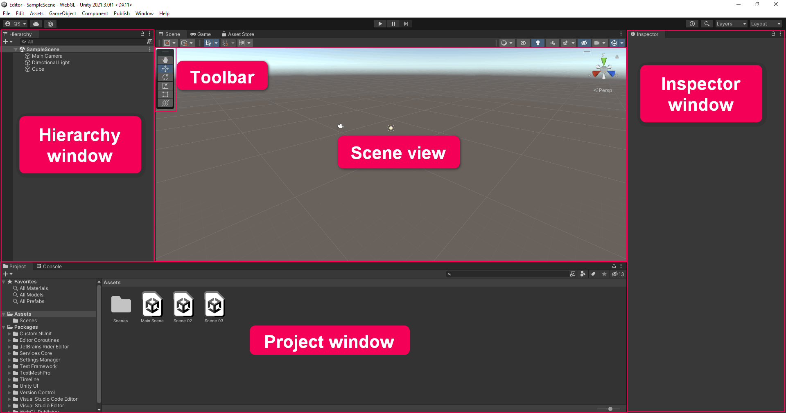
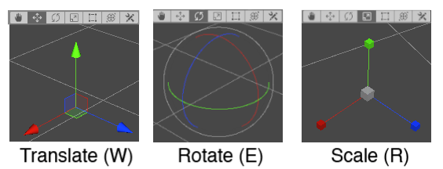
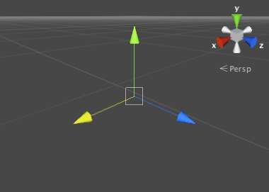
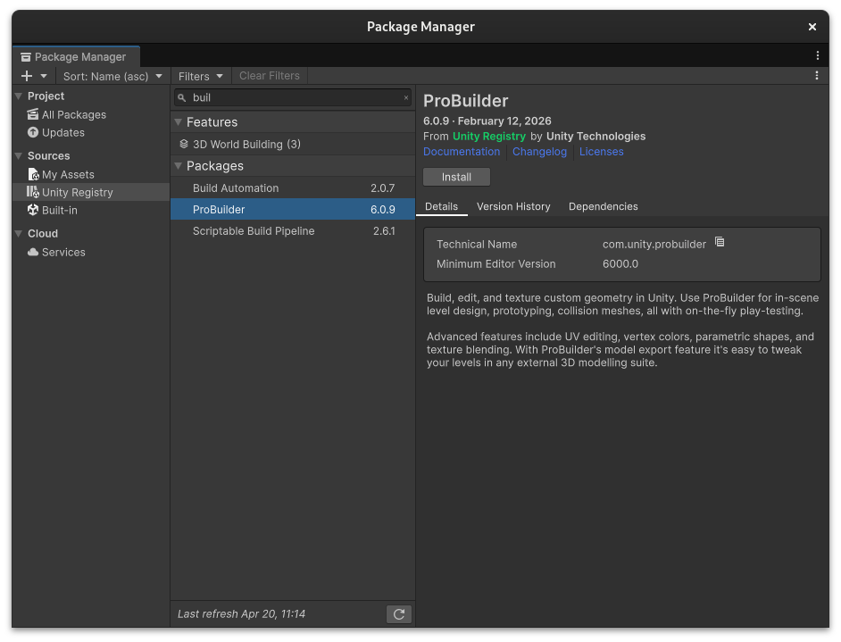
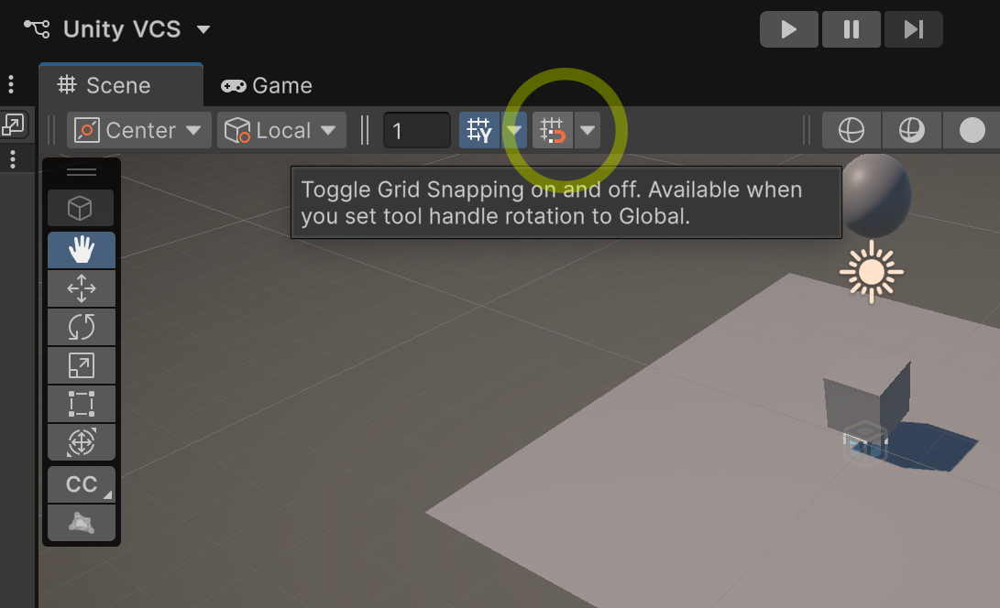
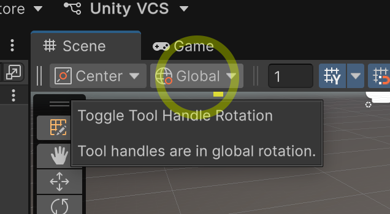
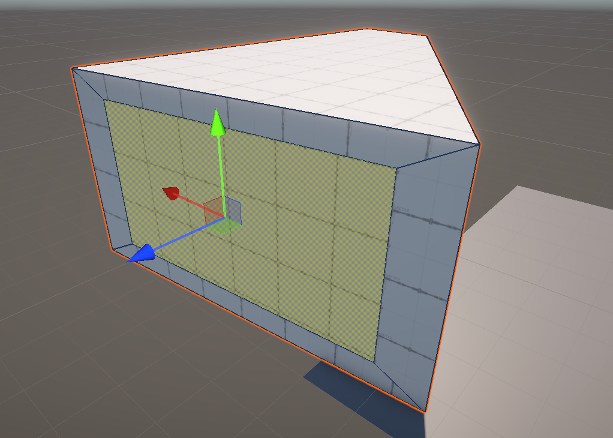
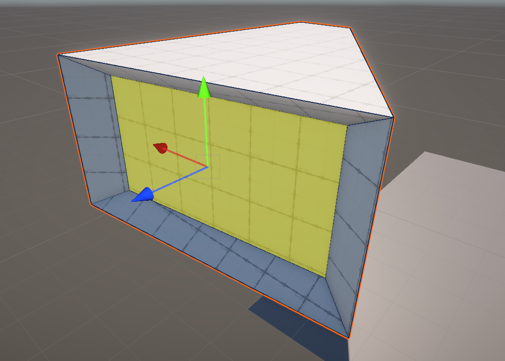

# Morning Session: Getting Started in Unity

**Wednesday, April 22 | 10:00 – 13:00**

In the morning, we're covering the core Unity interface and building a foundation for your virtual space. We'll go from "I've never opened this app" to walking around a custom-built 3D gallery with sound and basic interactivity.

## What we're doing

### 0. Project Setup
When you first open the Unity Hub, click **New Project**. Select the **Universal 3D** template. This ensures we are using the **Universal Render Pipeline (URP)**, which provides better performance and visual tools for our virtual environment.

### 1. The Editor Layout & Navigation
Unity has a lot of buttons, but you only need five main windows to start. We'll walk through the **Hierarchy**, **Project**, **Scene**, **Game**, and **Inspector** views.
- 
- **Controls:** Right-click and use **WASD** to fly around. Use **W, E, and R** to move, rotate, and scale things.
- **Coordinates:** Remember that **Y is Up**. 
- 
- 
- *Further Reading:* [Explore the Unity Editor](https://learn.unity.com/tutorial/explore-the-unity-editor-1?version=2021.3)

### 2. Making your first objects
Before we get technical, let's just make things move.
- **Floor & Walls:** Right-click the Hierarchy > **3D Object** > **Plane**.
- **Adding a Cube:** Right-click the Hierarchy > **3D Object** > **Cube**. 
  - Notice the **X, Y, and Z** coordinates in the **Inspector** tab. 
  - To bring it to the exact middle of the scene, click the three vertical dots to the right of **Transform** and select **Reset**. This centers it at (0, 0, 0) in the 3D world.
- **Aligning the Camera:** Press the **Play** button at the top. Notice how the camera probably isn't in a great spot? 
  - Stop Play mode. In the **Scene view**, fly to a position where you have a good view of your objects. 
  - Select the **Main Camera** in the Hierarchy and press **Shift + Cmd + F** (Mac) or **Shift + Ctrl + F** (Windows). You can also use **GameObject > Align with View**. This makes the camera see exactly what you see in the editor.
- **Physics:** Add a Sphere. Select the sphere, click **Add Component** in the inspector, and find the **Rigidbody**. 
  - Position the Sphere directly above your Cube. 
  - Select the Cube and use the **Rotate tool (E)** to tilt it slightly. 
- Hit **Play** and watch the sphere fall, hit the box, and roll off!

### 3. Atmosphere: Global Volume
With URP, your scene automatically includes a **Global Volume** object. Think of this as the "atmosphere" or a set of "filters" for your camera.
- Select the **Global Volume** in the Hierarchy.
- Look at the **Volume** component in the Inspector. 
- Expand the **Vignette** effect (or add it if it's missing) and try adjusting the **Intensity**. Notice how it darkens the edges of your view, giving it a more cinematic feel.

### 4. Setup: ProBuilder
We'll install **ProBuilder** together. This is a tool that lets you build architecture (walls, stairs, pedestals) directly inside Unity without needing an external 3D app.
- Open `Window` > `Package Manager`.
- Switch to the `Unity Registry` and search for **ProBuilder**.
- 

### 5. Building your space
Once ProBuilder is in, we'll start mocking up a gallery.
- **Grid Snapping:** Precision is key in 3D. At the top of the Scene view, enable **Grid Snapping** (the magnet icon). This ensures your walls and floors line up perfectly.
  - 
- **Global Handles:** Ensure your **Tool Handle Rotation** is set to **Global** (not Local). This makes it much easier to move objects along the main X, Y, and Z axes.
  - 

- **ProBuilder Shapes:** 
  1. Open the **ProBuilder Window** (`Tools > ProBuilder > ProBuilder Window`).
  2. Click **New Shape**. Try creating a **Cube**, then **Stairs** (you can rotate them by clicking the faint blue arrows that appear when you hover over them), and finally a **Pipe**. 
  3. Notice the **Shape Settings** window that appears when creating these—it lets you adjust things like the number of steps or the thickness of the pipe.

- **Sketching a Room:**
  1. Create a large, flat **Cube** to serve as your floor.
  2. Click the **ProBuilder Edit button** in the Scene view tools (it's located just above the Hand tool).
  3. Switch to **Face Selection** (the orange icon at the top of the scene).
  4. Select the edges of your floor and hold **Shift** while dragging up with the Move tool. This **extrudes** the faces to create walls!
  5. **Experiment:** Try moving and rotating individual faces.
  6. **Insetting:** Select a face, choose the **Scale tool (R)**, and hold **Shift** while dragging toward the center. This creates a new face *inside* the original one—perfect for windows or alcoves.
  - 
  - 
- **Scale:** Aim for real-world scale (1 Unity unit = 1 meter).
- **Importing:** Drag in images, textures, or 3D models you already have to start personalizing the space.

### 6. Walkthrough: First-Person Controls
We'll use a simple drag-and-drop controller so you can walk through your space like a gallery visitor.
- **Install:** Find the [Mini First Person Controller](https://assetstore.unity.com/packages/tools/input-management/mini-first-person-controller-174710) in the Asset Store, then pull it in via the Package Manager.
- **Setup:** Drag the prefab into the scene and **delete the default Main Camera**.
- **Tweak:** You can change the player height in the Inspector.

### 7. Sound & Interaction
- **Spatial Audio:** Drop in a sound file and set the **Spatial Blend** to 3D. Now it gets louder as you walk toward it.
- **Interactivity:** We'll look at a few basic scripts to trigger events, like a video starting when you enter a room.

### 8. Demo: Photogrammetry (Lunch Assignment)
Before we break, we’ll show you how to scan a physical object using **Polycam**. 
- Your goal for the break is to find one object (or a corner of a room) to scan and bring into Unity this afternoon.

---

## Morning Checklist
- Unity 6 is open and running.
- ProBuilder is installed.
- You can move, rotate, and scale objects.
- You have a basic room or floor started.
- You've got Polycam on your phone.
